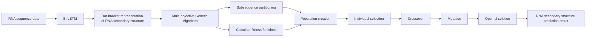

# RNA Secondary Structure Prediction Method Based on Multi-objective Genetic Algorithm and Deep Learning

**Diagram**

```mermaid
graph LR
  A[RNA sequence data] --> B[Bi-LSTM]
  B --> C[Dot-bracket representation of RNA secondary structure]
  C --> D[Multi-objective Genetic Algorithm]
  D --> E[Subsequence partitioning]
  D --> F[Calculate fitness functions]
  E --> G[Population creation]
  F --> G
  G --> H[Individual selection]
  H --> I[Crossover]
  I --> J[Mutation]
  J --> K[Optimal solution]
  K --> L[RNA secondary structure prediction result]
```

Source code will be coming soon.

